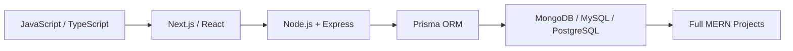

<div align="center">

# 👋 Hey, I'm Milan Bhandari

### 🌐 Full Stack Developer | 💻 JavaScript & TypeScript | ⚛️ Next.js & React | 🔺 MERN + Prisma

[](https://linkedin.com/in/milanbhandari047)
[](https://x.com/milanbhandari0)
[](https://facebook.com/milanbhandari047)
[](https://github.com/milanbhandari047)


<br/>


</div>

---

## 🎯 What I Do

```javascript
const milan = {
  role: "Full Stack Developer",
  languages: ["JavaScript", "TypeScript"],
  stack: "MERN",
  frameworks: ["Next.js", "React", "Node.js", "Express"],
  stateManagement: ["Redux", "Zustand"],
  database: ["MongoDB", "MySQL", "PostgreSQL"],
  orm: "Prisma",
  realtime: "Socket.io",
  testing: ["Jest", "Postman"],
  deployment: ["Vercel", "Netlify", "AWS", "Docker", "Firebase"],
  passion: ["Clean UI", "Web Development", "Building fun side projects"],
  currently: "Turning ideas into working full-stack apps"
};
```

- 🌐 **Full stack engineering** in JavaScript & TypeScript
- ⚛️ Architect frontends with **Next.js & React**
- 🔗 Build robust APIs with **Node.js & Express**, real-time features with **Socket.io**
- 🗄️ Model and query data across **MongoDB, MySQL & PostgreSQL** via **Prisma**
- 🧪 Validate with **Jest** and **Postman**, ship with **Docker**
- 🤝 Always open to collaborating on ambitious builds

### 💬 Ask me about


---

## 🛠️ Tech Stack & Tools

### **Languages**


### **Frontend**


### **Backend & Databases**


### **Testing & API**


### **Cloud & Deployment**


### **Design**


### **Tools**


---

## 📊 GitHub Analytics

<div align="center">
  
  
</div>

<div align="center">
  
</div>

<p align="center"><em>🐍 My contribution graph, eaten by a snake</em></p>
<div align="center">
  
</div>

<p align="center"><em>📈 Daily contribution activity</em></p>
<div align="center">
  
</div>

<p align="center"><em>🏆 Trophy case</em></p>
<div align="center">
  
</div>

<p align="center"><em>✍️ A little dev inspiration, refreshed on every view</em></p>

<div align="center">
  
</div>

---

## 🚀 Featured Projects

<p align="center"><em>Live cards below pull real-time stars & info straight from GitHub</em></p>

<div align="center">

<a href="https://github.com/milanbhandari047/Analog-Clock-Using-Html-Css-and-Js"></a>
<a href="https://github.com/milanbhandari047/DigitalMomo"></a>

<a href="https://github.com/milanbhandari047/Scientific_Calculator"></a>
<a href="https://github.com/milanbhandari047/AMC-IT-CLUB"></a>

<a href="https://github.com/milanbhandari047/Simple-Greeting-Website"></a>
<a href="https://github.com/milanbhandari047/Business-Card"></a>

</div>

---

## 💡 Core Expertise



- ⚛️ Architecting frontends with **Next.js & React**
- 🔗 Building production APIs with **Node.js & Express**
- 🗄️ Modeling data across **MongoDB, MySQL & PostgreSQL** with **Prisma**
- 🚀 Shipping to production via **Vercel, Netlify, AWS & Docker**
- ☁️ Managing media pipelines with **Cloudinary**

---

## 🤝 Open for Collaboration

I'm always happy to connect on:

- 💻 **Full Stack Projects** - frontend, backend, or end-to-end MERN builds
- 🏗️ **System & API Design** - structuring data models and backend architecture
- 🧪 **Open Source** - contributing to and maintaining real codebases
- 💡 **Product Ideas** - turning concepts into shipped, working apps

**Let's connect and build something solid together!**

---

## 📫 Get In Touch

<div align="center">

[](https://linkedin.com/in/milanbhandari047)
[](https://x.com/milanbhandari0)
[](https://facebook.com/milanbhandari047)

</div>

---

<div align="center">

### 💭 _"Build. Ship. Iterate."_ 🚀


**⭐ From [milanbhandari047](https://github.com/milanbhandari047) - Building, one commit at a time**

</div>
