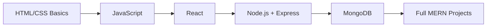

<div align="center">

# 👋 Hey, I'm Milan Bhandari

### 🌐 MERN Stack Developer | 💻 JavaScript Developer | 🎨 Frontend Enthusiast

[](https://linkedin.com/in/milanbhandari047)
[](https://x.com/milanbhandari0)
[](https://facebook.com/milanbhandari047)
[](https://github.com/milanbhandari047)


<br/>


</div>

---

## 🎯 What I Do

```javascript
const milan = {
  role: "MERN Stack Developer",
  stack: ["JavaScript", "React", "Next.js", "Node.js", "Express", "MongoDB"],
  learning: "Deepening my MERN stack skills every day",
  passion: ["Clean UI", "Web Development", "Building fun side projects"],
  currently: "Turning ideas into working web apps"
};
```

- 🌱 Currently **learning and building with the MERN stack**
- 🎨 Enjoy designing **clean, simple UIs** with HTML, CSS & React
- 🛠️ Comfortable across **frontend, backend, and databases**
- 🤝 Open to **collaborating** on web dev projects and learning together

---

## 🛠️ Tech Stack & Tools

### **Languages**


### **Frontend**


### **Backend & Databases**


### **Design & Deployment**


### **Tools**


---

## 📊 GitHub Analytics

<div align="center">
  
  
</div>

<div align="center">
  
</div>

<p align="center"><em>📈 Daily contribution activity</em></p>
<div align="center">
  
</div>

<p align="center"><em>🏆 Trophy case</em></p>
<div align="center">
  
</div>

<p align="center"><em>✍️ A little dev inspiration, refreshed on every view</em></p>

<div align="center">
  
</div>

---

## 🚀 Featured Projects

<table>
  <tr>
    <td align="center" width="50%">
      <h3>🕐 <a href="https://github.com/milanbhandari047/Analog-Clock-Using-Html-Css-and-Js">Analog Clock</a></h3>
      <p>A real-time analog clock built with <strong>HTML, CSS & JavaScript</strong></p>
      
    </td>
    <td align="center" width="50%">
      <h3>🍢 <a href="https://github.com/milanbhandari047/DigitalMomo">DigitalMomo</a></h3>
      <p>A web app project exploring <strong>JavaScript-driven ordering/UI flow</strong></p>
      
    </td>
  </tr>
  <tr>
    <td align="center" width="50%">
      <h3>🧮 <a href="https://github.com/milanbhandari047/Scientific_Calculator">Scientific Calculator</a></h3>
      <p>A functional scientific calculator built in <strong>C++</strong></p>
      
    </td>
    <td align="center" width="50%">
      <h3>🏫 <a href="https://github.com/milanbhandari047/AMC-IT-CLUB">AMC IT Club</a></h3>
      <p>A club website project showcasing <strong>JavaScript & web fundamentals</strong></p>
      
    </td>
  </tr>
  <tr>
    <td align="center" width="50%">
      <h3>👋 <a href="https://github.com/milanbhandari047/Simple-Greeting-Website">Simple Greeting Website</a></h3>
      <p>A friendly greeting site built with <strong>JavaScript</strong></p>
      
    </td>
    <td align="center" width="50%">
      <h3>💼 <a href="https://github.com/milanbhandari047/Business-Card">Business Card</a></h3>
      <p>A digital business card built with <strong>HTML</strong></p>
      
    </td>
  </tr>
</table>

---

## 💡 Currently Focused On



- 📚 Sharpening **React & component-based UI design**
- 🔗 Connecting frontend apps to **Node/Express APIs**
- 🗄️ Practicing **MongoDB & MySQL** for data-driven apps
- 🚀 Deploying projects on **Vercel & Netlify**

---

## 🤝 Open for Collaboration

I'm always happy to connect on:

- 💻 **Web Development Projects** - frontend, backend, or full MERN
- 📚 **Learning Together** - pairing up on tutorials & challenges
- 🧪 **Open Source** - contributing to and learning from real codebases
- 💡 **Fun Side Projects** - turning small ideas into working apps

**Let's connect and build something cool together!**

---

## 📫 Get In Touch

<div align="center">

[](https://linkedin.com/in/milanbhandari047)
[](https://x.com/milanbhandari0)
[](https://facebook.com/milanbhandari047)

</div>

---

<div align="center">

### 💭 _"Code. Learn. Repeat."_ 🚀


**⭐ From [milanbhandari047](https://github.com/milanbhandari047) - Building, one commit at a time**

</div>
